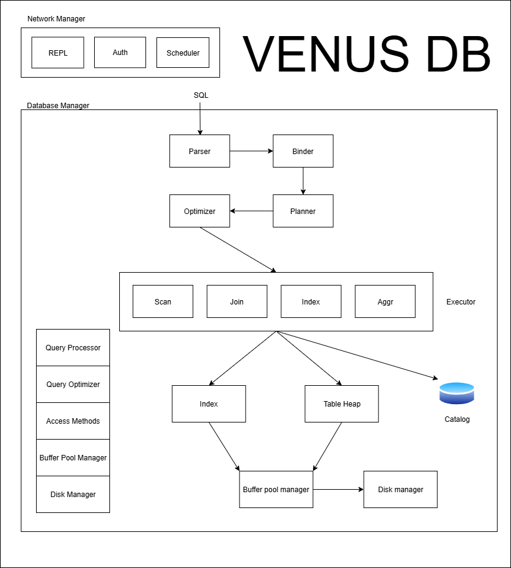

# Venus DB

A simple SQL database system built from scratch in C++ to understand the internal workings of database systems. This project is inspired by Sir Arpit Bhayani and Prof. Andy Pavlo's educational content on database internals.

## Project Goals

- **Educational**: Learn database internals by building one from scratch
- **Simple**: Focus on core concepts without unnecessary complexity
- **Functional**: Support basic SQL operations with proper architecture

## Features

### Currently Implemented
- **SQL Parser**: Basic SQL command parsing (CREATE, INSERT, SELECT, etc.)
- **Storage Engine**: Page-based storage with tuple management
- **Buffer Pool Manager**: In-memory page caching with LRU-K replacement
- **Catalog System**: Metadata management with system tables
- **Query Executor**: Volcano-style iterator execution model
- **Basic SQL Operations**:
  - `CREATE DATABASE`, `USE DATABASE`, `DROP DATABASE`, `SHOW DATABASES`
  - `CREATE TABLE`, `DROP TABLE`, `SHOW TABLES`
  - `INSERT INTO` with values
  - `SELECT *` and `SELECT columns` with projection
  - Basic table scanning

### Architecture



*Venus DB follows a layered architecture with clear separation between parsing, planning, execution, and storage layers.*

## Technical Details

### Data Types Supported
- `INT` - 32-bit integers
- `FLOAT` - 32-bit floating point
- `CHAR` - Fixed-length strings (max 32 chars)

### Storage Model
- **Row-oriented storage** (N-ary Storage Model)
- **Page-based** storage (4KB pages)
- **Slotted page layout** with slot directory
- **Record ID** addressing (page_id, slot_id)

### Key Components
- **Disk Manager**: File I/O operations
- **Buffer Pool**: Page caching with LRU-K replacement
- **Catalog Manager**: System tables for metadata
- **Table Heap**: Table data management
- **Executor Framework**: Iterator-based query execution
- **Parser**: SQL command parsing


##   Getting Started

### Prerequisites
- C++17 or later
- CMake 3.10+
- Linux/WSL environment (currently)

### Building
```bash
git clone https://github.com/karthikeyaspace/venus-db.git
cd venus-db
mkdir build && cd build
cmake ..
make
```

### Running
```bash
./venus
```

make sure this is performed in linux environment (Ubuntu is preferred)

### Example Usage
```sql
venus> CREATE DATABASE mydb
venus> USE mydb  
venus> CREATE TABLE planets (id INT PRIMARY KEY, name CHAR, radius FLOAT)
venus> INSERT INTO planets VALUES (1, 'Earth', 6371.0)
venus> INSERT INTO planets VALUES (2, 'Mars', 3389.5)
venus> SELECT * FROM planets
venus> SELECT name, radius FROM planets
venus> SHOW TABLES
venus> EXIT
```

see notes.md for more

## Contributing

This is an educational project, but contributions are welcome!

## Learning Resources

This project was inspired by:
- [CMU Database Systems Course](https://15445.courses.cs.cmu.edu/)
- [Arpit Bhayani](https://www.youtube.com/@ArpitBhayani)

## Limitations

- There are a lot, the main goal of this project is to learn databases and C++.

## Author

**Karthikeya** - [@karthikeyaspace](https://github.com/karthikeyaspace)

---

*Built with ❤️ for learning database internals*
